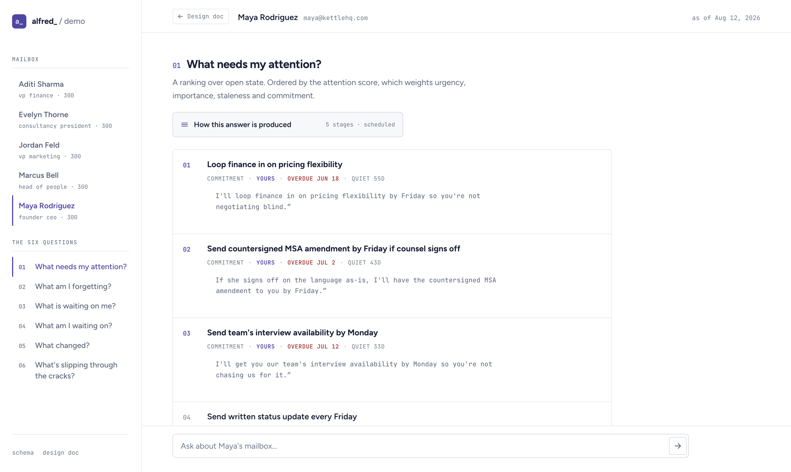
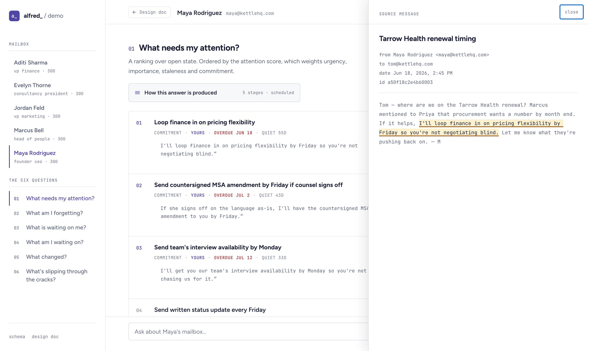
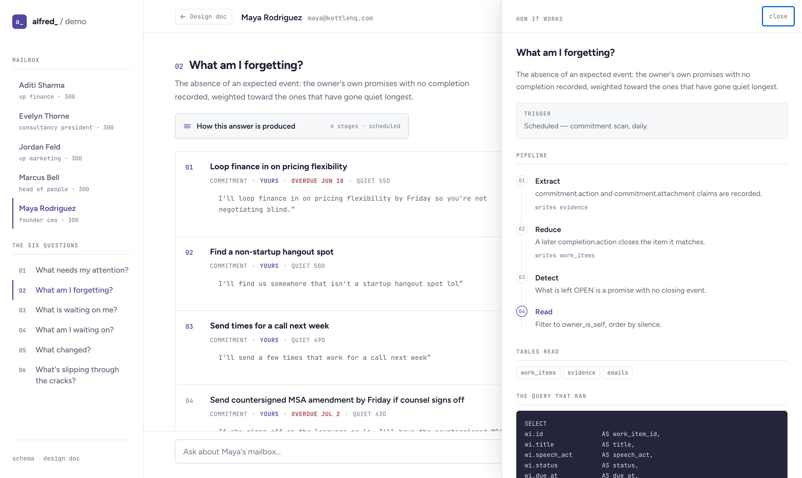
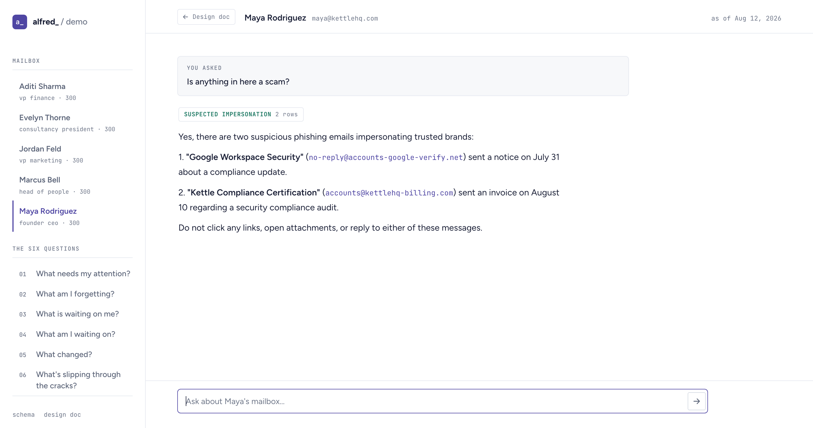

<div align="center">

# alfred_

### An evidence ledger for email

**Six questions an inbox can't answer by searching — answered from 1,500 messages, every claim traceable to the sentence it came from.**

[**Live demo**](https://krantiyeole20.github.io/alfred-challenge/demo/) · [**Design doc**](https://krantiyeole20.github.io/alfred-challenge/) · [Build plan](docs/build-plan.md) · [Semantics](docs/QUESTIONS.md)

</div>

---

<div align="center">

</div>

---

## The problem

The six questions alfred_ has to answer look like search problems. They are not.

| Question | What it actually requires |
|---|---|
| What is waiting on me? | A state that has persisted |
| What am I waiting on? | The same state, ownership inverted |
| What changed? | A comparison between two points in time |
| What am I forgetting? | The **absence** of an expected event |
| What needs attention? | A ranking over open state |
| What's slipping? | Open state plus unusual silence |

All six are temporal or relational. None is semantic. A chunk-embed-retrieve pipeline is stateless per query — there is nothing to compare against, so "what changed" gets invented.

So this stores a **ledger of claims over time** instead, and the six questions become indexed queries.

> **The LLM proposes. A deterministic layer disposes.**

The model reads one email and emits structured claims with verbatim quotes. It never decides current state, never updates, never deletes. A plain, testable reducer folds those claims into answers. "What changed" is a range scan, not a generation task.

## What's actually built

```
1,500 emails  →  signals  →  extraction  →  reducer  →  six questions
   5 mailboxes    no LLM      1 LLM call     no LLM      pure SQL
                              per message
```

| | |
|---|---|
| Messages processed | **1,500** across 5 mailboxes |
| Claims extracted | **1,259** — every one quote-verified |
| Quarantined as unverifiable | **2** |
| Work items after the fold | 1,126 (1,062 open) |
| Impersonation attempts caught | **10** |
| Total extraction cost | **$0.94** |
| Tests | **49 passing** |

## Every answer carries its citation

Not by prompting — by construction. A claim whose quote cannot be found verbatim in its source never enters the ledger. Click any citation and the source message opens with the quote highlighted **exactly where it was found**.

<div align="center">

</div>

## Every answer shows its work

Each question exposes the job that produced it — the trigger, the pipeline stages, what each stage writes, and the SQL that actually ran.

<div align="center">

</div>

## Ask in your own words

The agent has six fixed tools (one per question, identical SQL to what the scorer measures), a participant lookup, and a read-only SQL escape hatch. Tool calls execute **in your browser** against a local SQLite copy — the proxy never sees the mail.

<div align="center">

</div>

All six questions route correctly when asked indirectly:

| Asked as | Tool chosen |
|---|---|
| "catch me up, what should I look at first?" | `needs_attention` |
| "did I drop anything?" | `forgetting` |
| "what's on my plate right now?" | `waiting_on_me` |
| "who hasn't gotten back to me?" | `waiting_on_others` |
| "anything move or shift recently?" | `what_changed` |
| "what's quietly falling through the cracks?" | `slipping` |

## Two findings worth reading

**Merging people on display name destroys the fraud signal.** Resolving two addresses to one person when the display name matches is how `same_person_two_addresses` gets solved. It also folds an impersonator into the very person they're impersonating — `billing@klaviyo-billing.com` merged silently into the real `billing@klaviyo.com`. The discriminator is registrable domain at a **token boundary**: `email.united.com` sits under `united.com` (merge), while `klaviyo-billing.com` merely appends a word to the brand (never merge). A bare substring test also flags `vanta.com` against `vantageassurance.com`, which is nothing at all. See [`identity.py`](src/pipeline/identity.py).

**The noise gate wasn't worth what it cost.** Every candidate rule scored against the gold sets by [`tools/measure_noise_gate.py`](tools/measure_noise_gate.py) — "real work lost" counts gold items whose source email the rule would have discarded before extraction ever saw it:

| Gate rule | Real work lost | Gated | Extraction cost |
|---|---|---|---|
| Gmail category OR bulk headers | **88** | 483 | $0.53 |
| List-ID OR (promo AND automated) | 3 | 139 | $0.71 |
| List-ID first, transactional override | 3 | 138 | $0.71 |
| **shipped: transactional checked first** | **2** | 134 | $0.72 |
| List-ID only | 3 | 95 | $0.74 |
| No gate | 0 | 0 | $0.79 |

The aggressive gate saves **$0.26** and destroys **88** real obligations. Ordering turned out to matter as much as the rules: checking List-ID before the transactional override still dropped a plan-renewal notice and a speaker-slot confirmation, because the override sat behind the rule that had already discarded them. Moving it first recovers one for $0.002. See [`signals.py`](src/pipeline/signals.py).

## Run it

```bash
python3 -m venv .venv && .venv/bin/pip install pydantic python-dotenv google-genai pytest
```

Create `.env`:

```bash
GEMINI_API_KEY=AIza...
```

Then:

```bash
.venv/bin/python -m src.pipeline.run all
```

Stages are idempotent and independently re-runnable. Only `extract` costs money, and it aborts at `ALFRED_BUDGET_USD`.

```bash
.venv/bin/python -m src.pipeline.run list-models      # confirm model ids
.venv/bin/python -m src.pipeline.run extract --limit 25    # cheap smoke test
.venv/bin/python -m src.pipeline.run extract --profile founder
.venv/bin/python -m src.pipeline.run extract --retry-failures  # escalate misses
.venv/bin/python -m src.pipeline.run score
```

Serve the demo locally, agent included:

```bash
.venv/bin/python tools/serve_demo.py     # http://localhost:8899/demo/
```

## How the demo is free to run

The corpus is read-only and small, so it ships as a **2.6 MB SQLite file the browser queries in WASM**. No database server, no cold starts, nothing to keep alive. A Cloudflare Worker exists for exactly one reason — an API key cannot live in a static page — and enforces a per-IP rate limit plus a hard global daily cap in D1.

Tool calls run in the tab. The freeform SQL tool is therefore safe by construction: it queries a disposable copy in the visitor's own browser, with no backend to attack.

## Honest numbers

Recall against the gold sets is **~35%**, and the breakdown matters more than the headline:

```
q2_forgetting              88.5%      q1_needs_attention      11.8%
q3_waiting_on_me           51.7%      q5_what_changed         18.5%
q4_waiting_on_others       35.7%      q6_slipping              7.7%
```

**88% of gold items do reach a work item; only ~35% surface in the top 12.** Extraction works — the gap is ranking and the question filters, which is a tuning problem rather than an architecture one, and costs nothing in API calls to close. It is the most obvious next piece of work and it is not done.

Also not done: the demo exercises the read path but does not yet surface the ledger itself — the append-only evidence chain, superseded values, and the quarantine are the parts of the schema that most distinguish it, and they aren't visible.

## Layout

```
src/pipeline/     load → signals → extract → reduce → score, behind one CLI
  questions.py    the six questions as SQL — one source of truth for the
                  scorer and the demo agent, so they cannot drift
  identity.py     registrable-domain comparison; the impersonation guard
  schema_sqlite.sql   the shipped read-path subset of the 35-table design
tests/            49 invariant tests
web/docs/         the design doc (GitHub Pages)
web/docs/demo/    the demo, sharing the doc's skin
worker/           Cloudflare Worker: key proxy, rate limit, budget cap
tools/            local streaming proxy, so the agent runs without a deploy
data/             the corpus, ground truth, and gold sets
```

## A note on the data

Every person, company, domain and dollar figure is invented. The mail is written to read like a leak rather than a template — that is what makes it useful — but none of it is real.
